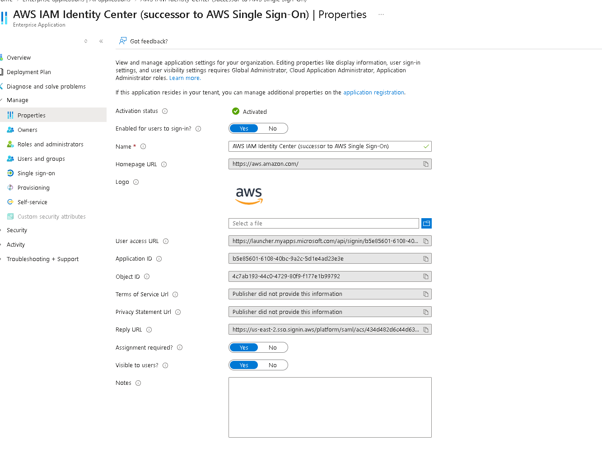
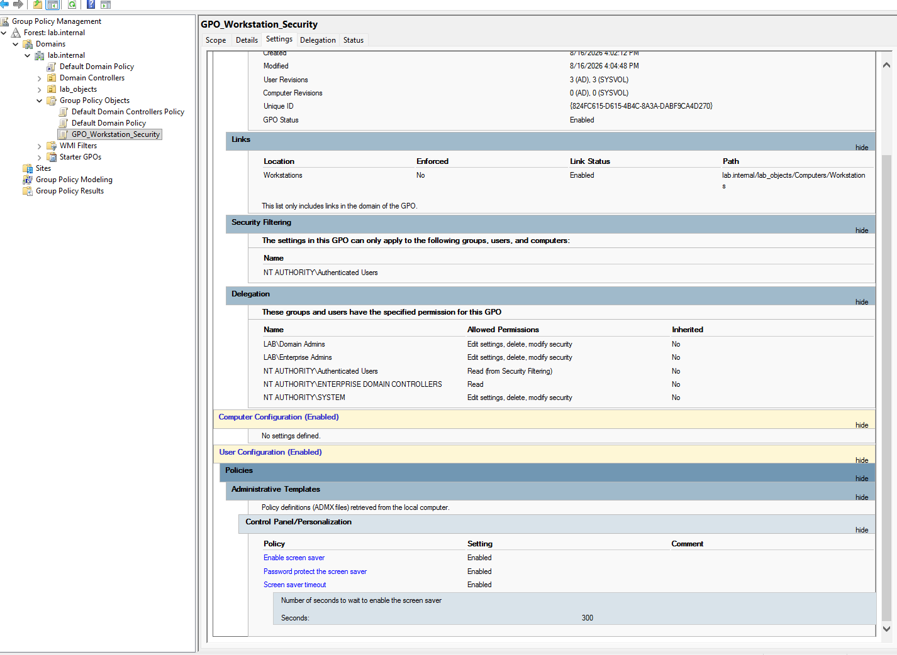
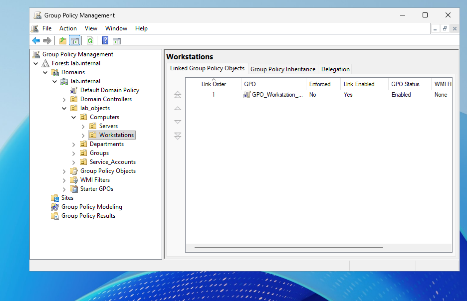
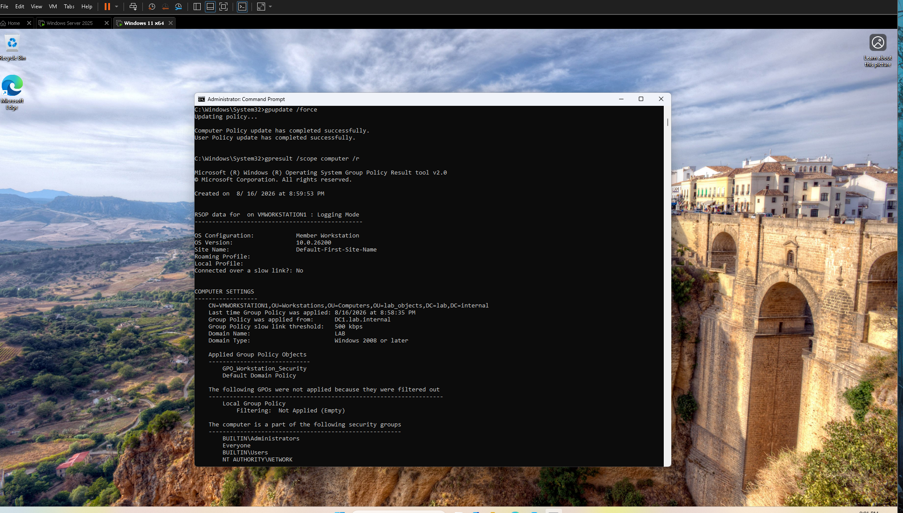

# federated-user
Cloud identity federation lab implementing SAML 2.0 SSO between Microsoft Entra ID and AWS IAM Identity Center for centralized, credential-less access control
### 1. Entra ID Enterprise Application Setup
Configured the **AWS IAM Identity Center** Enterprise Application within Microsoft Entra ID to establish the SAML 2.0 service provider trust.

---

### 2. SAML Attribute & Claims Mapping
Mapped the `Unique User Identifier (Name ID)` claim to `user.mail` to bypass external guest account UPN character restrictions (`#EXT#`).

---

### 3. AWS Identity Source Configuration
Switched the IAM Identity Center Identity Source to **External identity provider** and imported the Entra ID SAML metadata.

---

### 4. Account Assignment & Access Portal
Assigned the federated user identity to the target AWS account with the `Administratoraccess` permission set.

